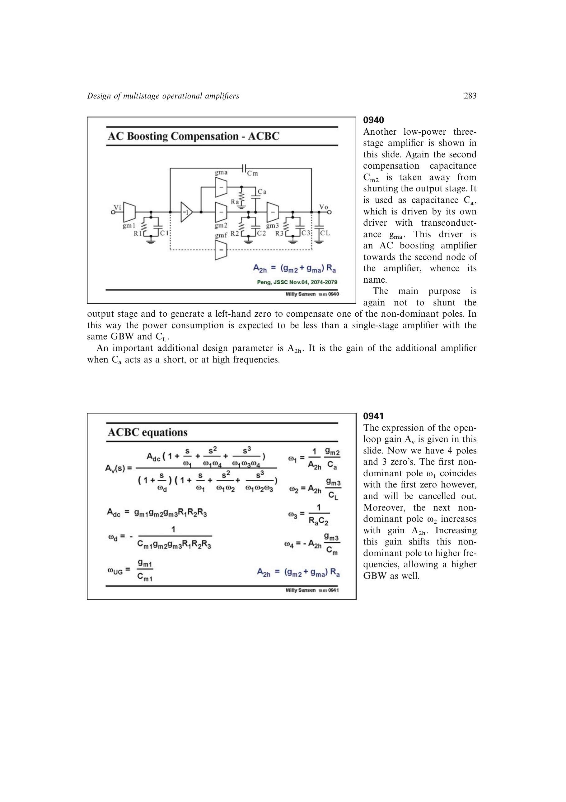

# AC boosting 补偿

ACBC 把原本分流输出级的第二补偿电容改为由独立跨导 `g_ma` 驱动的电容 `Ca`。附加高频增益 `A2h=(g_m2+g_ma)Ra` 既推高下一非主极点，又生成用于抵消主要非主极点的左半平面零点。

其开环响应含四极点三零点；第一极点与第一零点抵消后，把关键未抵消极点设在约 `2*GBW` 可得到 60 度左右裕度。相同负载和功耗下，GBW 约为传统 NMC 的 17 倍。

来源：第 9 章 pp. 283-285，0940-0944。

## 原书图示

