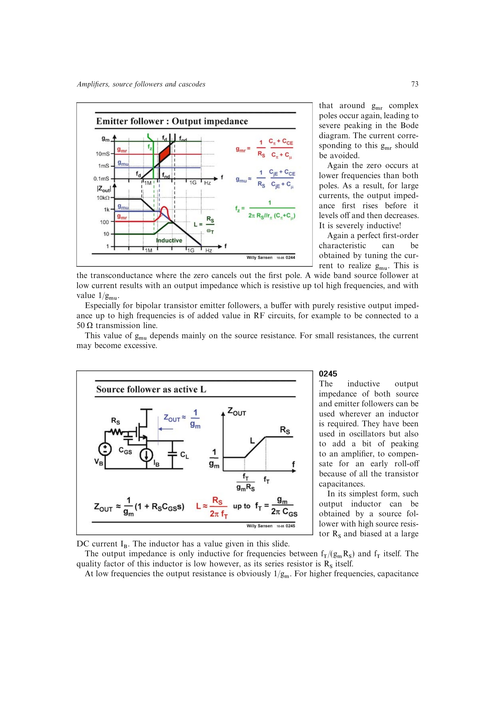

# 跟随器有源电感

当源跟随器由较大源电阻驱动且偏置电流较高时，`CGS` 使输出阻抗从低频 `1/gm` 向较高频 `RS` 上升，在约 `fT/(gmRS)` 到 `fT` 间表现为感性。源书给出一阶电感量尺度 `L ~= RS/(2*pi*fT)`。

该有源电感可为放大器引入可调峰化、补偿电容造成的提前滚降，但串联损耗约为 `RS`，品质因数不高。二极管连接负载或局部反馈结构可实现高等效 `RS` 并降低电压余量。

来源：第 2 章 pp. 73-75，0245-0247。

## 原书图示

