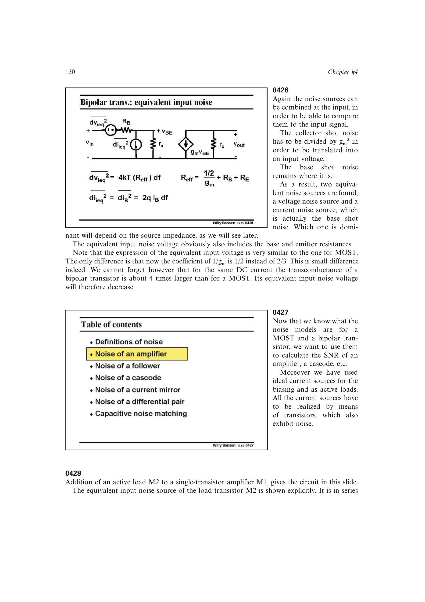

# 有源负载噪声折算

共源输入管 `M1` 与有源负载 `M2` 的输出噪声折算到输入后，负载项按 `(g_m2/g_m1)^2` 缩放。要使负载噪声次要，应让 `M2` 采用较小 `W/L` 和较大过驱动，从而在同一电流下降低 `g_m2`。

对闪烁噪声还要同时考虑面积；书中的近似优化给出输入管沟道长度可显著大于负载管，但需用级联结构补偿负载短沟道造成的增益损失。

来源：第 4 章 pp. 130-132，0427-0429。

## 原书图示

