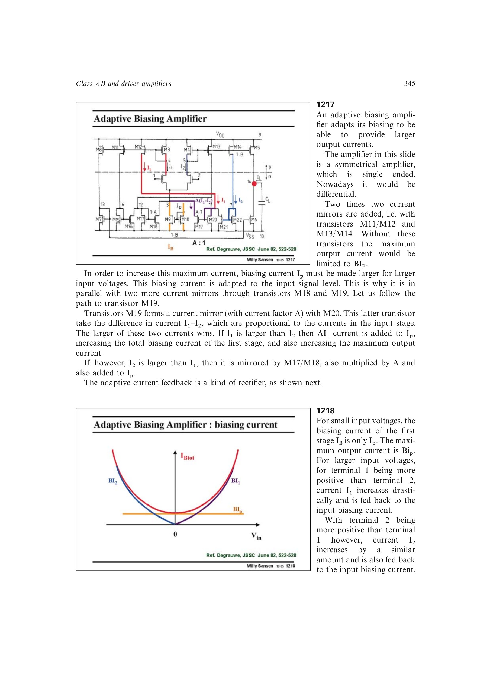

# 自适应偏置扩张系数上限

自适应偏置系数 `A` 越大，输出电流随输入扩张越强；`A=0` 时仍是普通限幅级。实际 `A` 受电流镜匹配限制，书中给出的实用量级约为 10，级联镜可改善匹配并允许更大值。

新增镜像管同时挂在原来的非主极点节点，增加电容并降低带宽。因此 `A` 不是越大越好，必须同时检查工艺失配和非主极点。

来源：第 12 章 pp. 345-346，1217-1219。

## 原书图示

