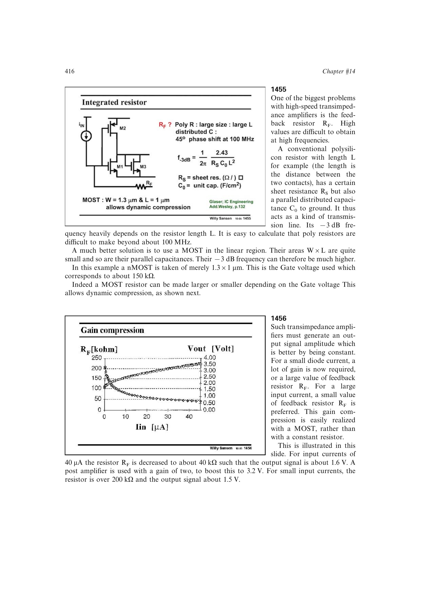

# 自适应跨阻压缩

光电流小时需要较大 `RF` 取得足够输出，光电流大时需要减小 `RF` 防止饱和。以线性区 MOS 实现可变反馈电阻，可随输入幅度降低闭环跨阻，使输出摆幅近似恒定。

单元级实现中，pMOS 反馈器件随大输入电流提供所需压缩，而 nMOS 可能使阻值向错误方向变化。压缩规律仍须与噪声匹配和带宽共同优化。

来源：第 14 章 pp. 416-417，1456-1457。

## 原书图示

