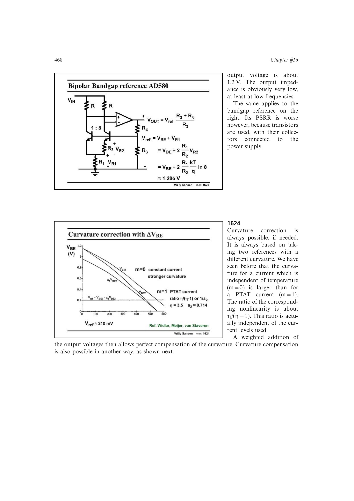

# 带隙基准曲率补偿

一次斜率修调后，剩余误差主要是 `VBE` 的非线性曲率。可对不同温度指数 `m` 的两个 `VBE` 曲线作加权差，利用其曲率比约 `eta/(eta-1)`；也可生成二阶 PTAT 电流并注入反向抛物线项。

曲率补偿通常需要第二个可调自由度。源书的低压实现通过恒流结与 PTAT 电流结的 `Delta VBE` 构造修正，把 80 degC 范围内误差从约 0.8 mV 降到 0.3 mV。

来源：第 16 章 pp. 468-469、477，1624-1626、1641。

## 原书图示

