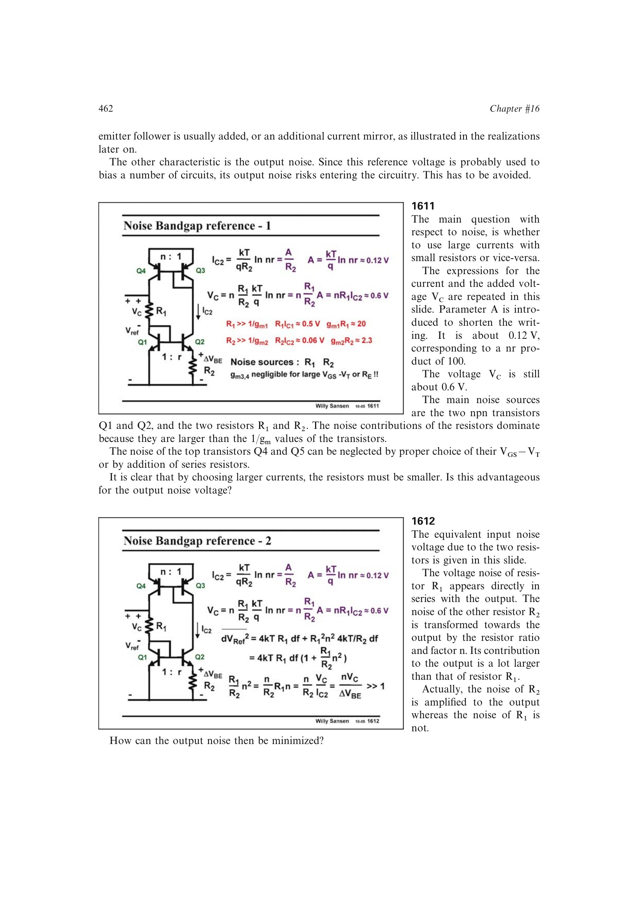

# 带隙基准输出噪声

基本带隙单元的主要输出噪声常来自两只设定 PTAT 增益的电阻。`R1` 的热噪声直接出现在输出，`R2` 的噪声则被镜像比和电阻比放大，通常占主导。

在 `Vc` 固定约 0.6 V 时，提高 PTAT 支路电流会减小所需电阻；增大器件面积比 `r` 会增大 `Delta VBE`，两者都降低输出噪声。为同一增益增加 `r` 通常优于增加镜像比 `n`。

来源：第 16 章 pp. 462-463，1611-1613。

## 原书图示

