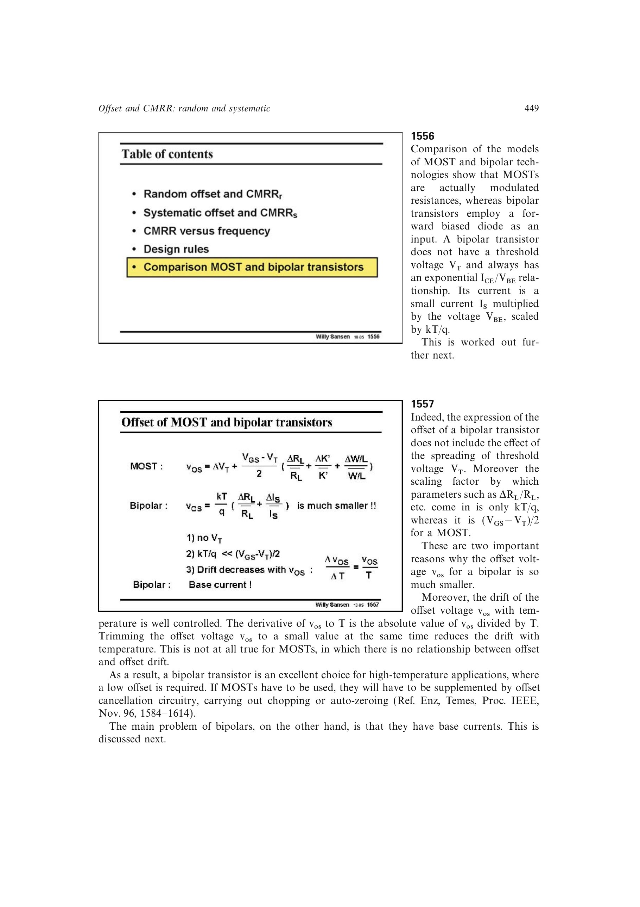

# 双极型输入级的低失调优势

双极型差分对没有 MOST 的阈值电压失配项；负载和几何误差折算到输入时由热电压 `UT=kT/q` 缩放，而 MOST 对应尺度是 `VOV/2`。这两点使同面积双极型输入级通常具有更低失调。

其失调温漂还近似满足 `|dvos/dT|=|vos|/T`，因此把失调修调到小值也会同步减小温漂。MOST 不具备这一直接关系，常需斩波或自动调零电路。

来源：第 15 章 pp. 449-450，1555-1557。

## 原书图示

