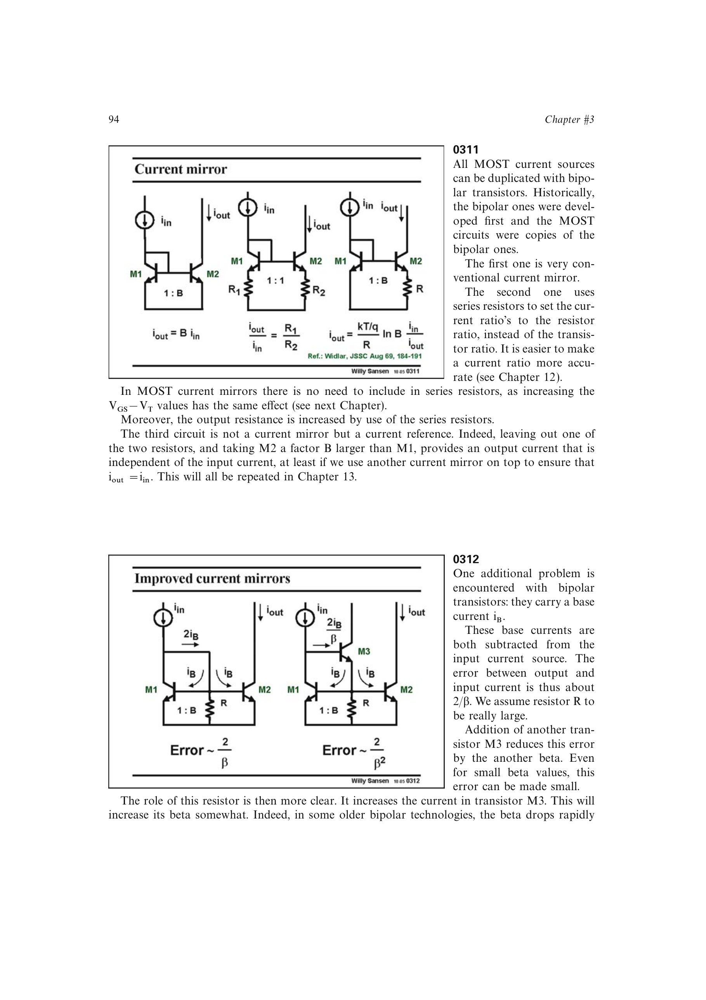

# 双极型电流镜

双极型电流镜利用相同 `VBE` 复制指数电流，也可加发射极电阻用电阻比设置更准确的比例并提高输出电阻。基极电流从输入支路取走电流，使基本两管镜的相对误差约为 `2/beta`。

加入第三只晶体管可再用一个 `beta` 因子降低误差；BiCMOS 中也可用近零栅电流的 MOST 提供基极电流补偿，但新反馈环路的高频峰化必须检查。

来源：第 3 章 pp. 94-95，0311-0312。

## 原书图示

