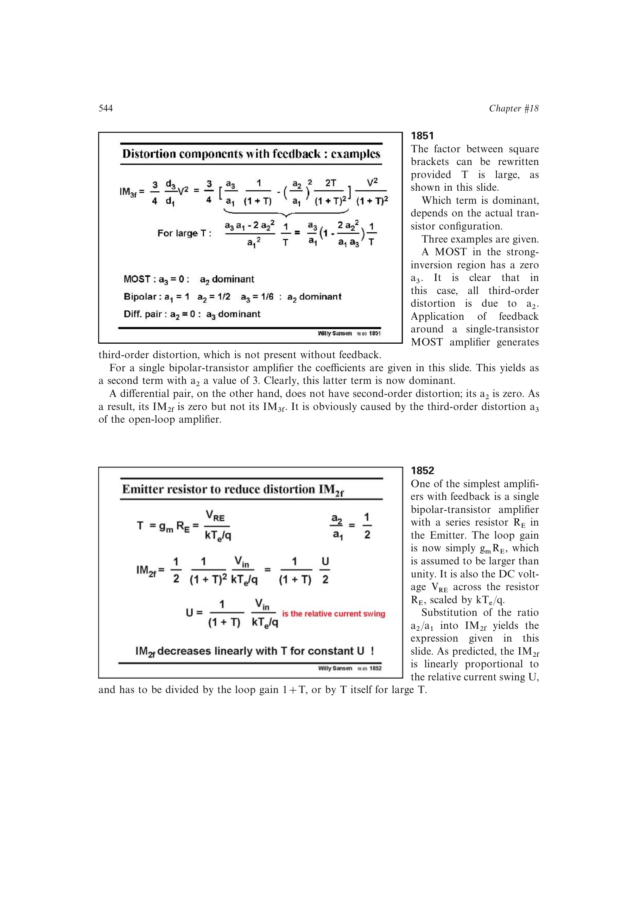

# BJT 发射极退化失真

BJT 发射极串联 `RE` 形成局部反馈，低频环路增益约为 `T=gm*RE=VRE/UT`。在大 `T` 下，`IM2` 与 `IM3` 都随退化量增加而近似按 `1/T` 下降；同时，为维持相同输出电流摆幅，所需输入电压会上升。

书中三阶表达式在 `T=0.5` 附近出现尖锐零点，但它对参数过于敏感，不适合作为稳健设计点。退化还消耗电压余量，并引入电阻热噪声。

来源：第 18 章 pp. 544-546，图 18.52-18.55。

## 原书图示

