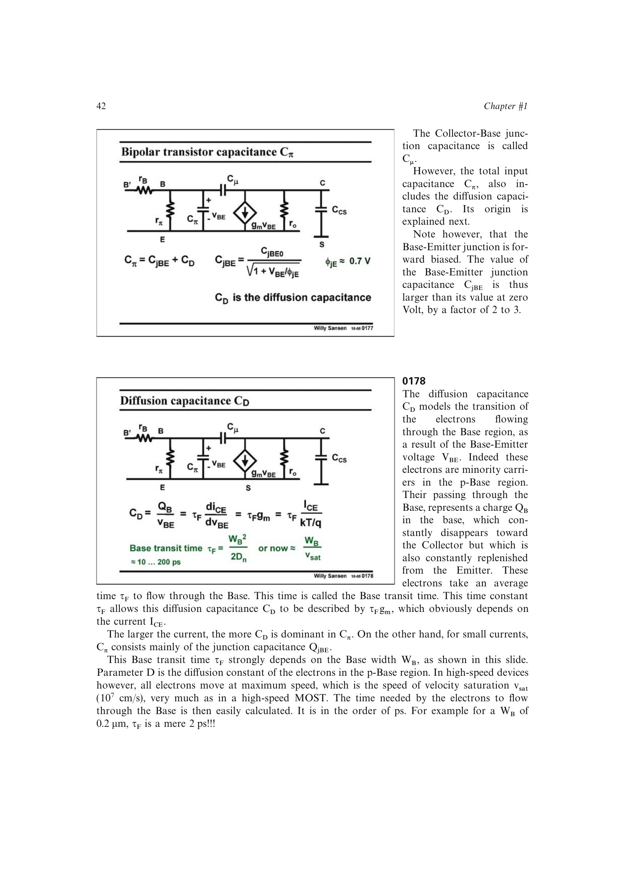

# 双极型截止频率 fT

双极型器件的 `fT` 同样定义为输出短路时电流增益为 1 的频率：

`fT = gm/[2*pi*(Cpi + Cmu)]`

`= 1/{2*pi[tauF + (CjBE+Cmu)/gm]}`。

低电流时结电容项使 `fT` 随电流上升；中等电流时趋近渡越时间上限 `1/(2*pi*tauF)`；很高电流下电流增益和速度会再次下降。缩短基区宽度可减小 `tauF`，但垂直器件的几何主要由工艺决定。

来源：第 1 章，书页 42-44，幻灯片 0178、0180-0182。

## 原书图示

