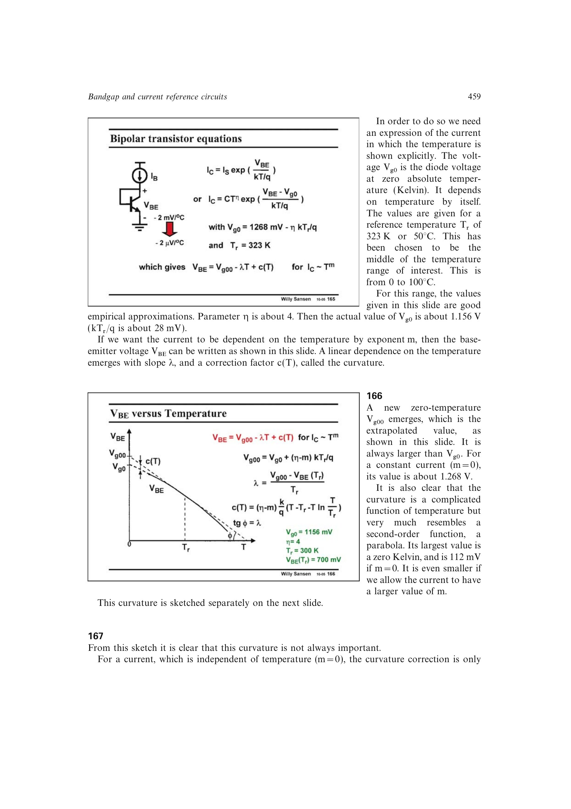

# VBE 温度曲率

`VBE` 除线性温漂外还含

`c(T)=(eta-m)*UT*(T-Tr-T*ln(T/Tr))`。

它在参考温度 `Tr` 附近近似抛物线。恒流偏置 `m=0` 的曲率较强；PTAT 电流偏置 `m=1` 时更弱。温区仅离 `Tr` 约 50 degC 时，曲率约数 mV，可能小于未修调失配；完成一次修调后它才常成为主导误差。

来源：第 16 章 pp. 459-460，166-167。

## 原书图示

