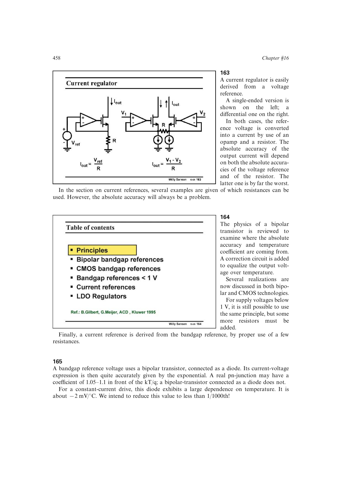

# 双极型 VBE 温度律

二极管连接双极管满足 `IC=IS*exp(VBE/UT)`。把饱和电流的温度依赖显式展开，并令 `IC` 随温度按 `T^m` 变化，可写成

`VBE(T)=Vg00-lambda*T+c(T)`。

`lambda` 给出近似线性负温漂；恒流偏置时约为 `-2 mV/degC`。`Vg00` 是向绝对零度外推的截距，恒流时源书取约 1.268 V；`c(T)` 是非线性曲率项。

来源：第 16 章 pp. 458-460，165-167。

## 原书图示

