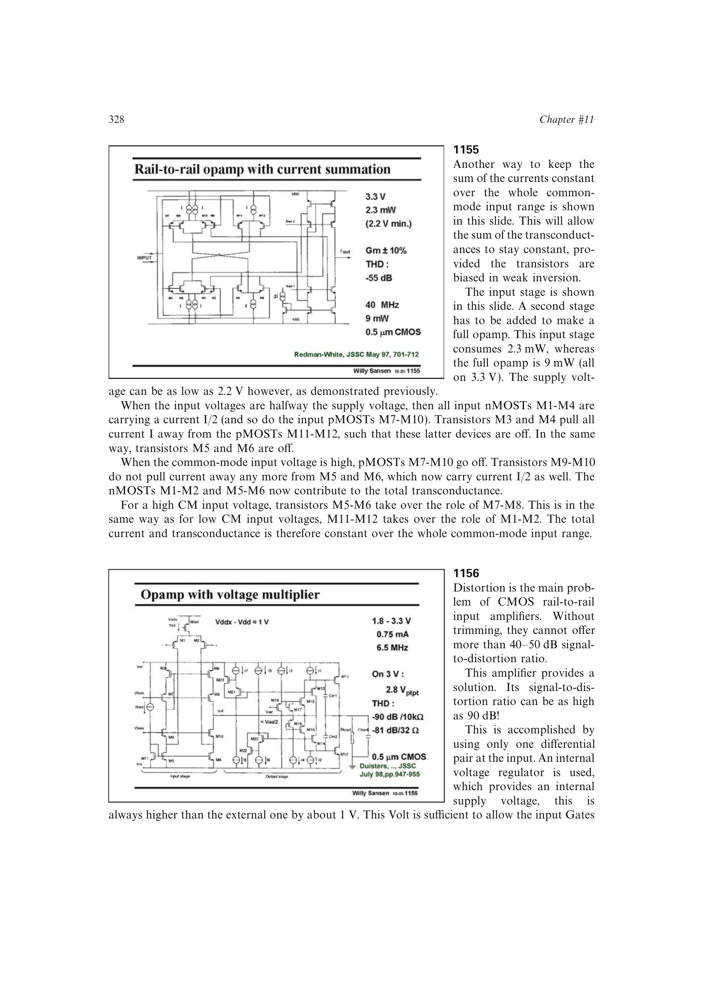

# 升压单输入对轨到轨输入

升压单输入对方案用内部稳压器生成比外部电源约高 1 V 的内部轨，只让一套差分对处理整个外部共模范围。输入栅极因获得额外余量，可覆盖外部两条电源轨。

由于没有 nMOST/pMOST 两套输入对接管，失调过渡失真被根本移除；书中信号失真比可达约 90 dB，而普通未修调 CMOS 互补输入常只有 40-50 dB。代价是需要升压供电及其稳压、噪声和可靠性设计。

来源：第 11 章 pp. 328-329，1156。

## 原书图示

