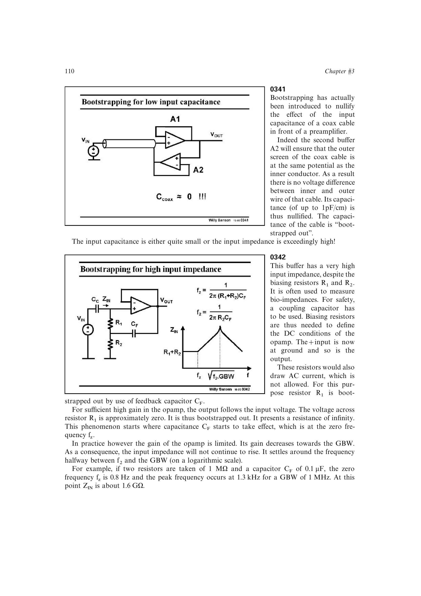

# 自举

自举用近单位增益缓冲让阻抗元件两端随信号同向移动，使其交流压差接近零。于是电缆电容、偏置电阻或晶体管输出电阻在目标频带中的等效影响被显著减小。

它可提高输入阻抗或放大器等效负载电阻，从而增加低频增益；有限缓冲增益和带宽决定效果的起止频率。和其他增益增强技术一样，自举通常不提高输入跨导对主负载电容决定的 GBW。

来源：第 3 章 pp. 110-113，0341-0346。

## 原书图示

