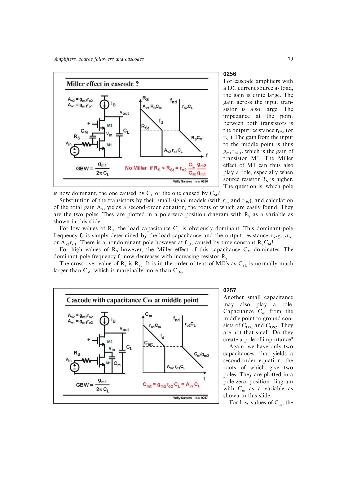

# 级联放大器内部极点

cascode 中间节点不是自动“无关”。输入管漏端相关电容可通过其局部增益产生 Miller 效应；当信号源电阻很大时，该输入侧时间常数可能取代输出 `Rout*CL` 成为主极点。

中间节点对地电容 `Cm` 通常形成约 `Cm/gm2` 的非主极点，若 `CL >> Cm` 会远高于 GBW；只有异常大的 `Cm` 才会由 `ro1*Cm` 主导。设计时应分别检查源阻抗驱动的 Miller 极点和中间节点极点。

来源：第 2 章 pp. 79-80，0256-0257。

## 原书图示

