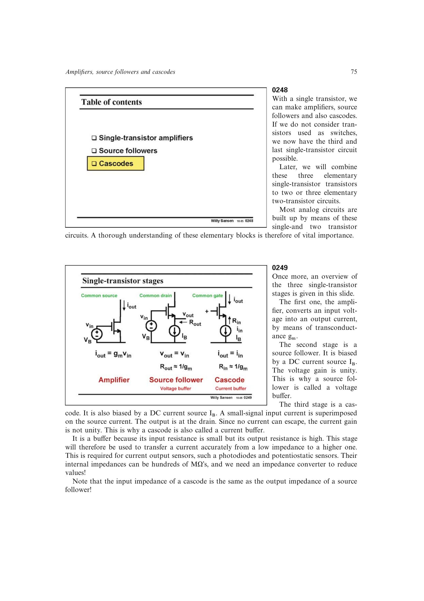

# 单管级联管跨阻

对带有限源电阻 `RB`、输出电阻 `rDS` 和负载 `RL` 的共栅级，输出电压/输入电流的跨阻随 `RL` 增加，最终受临界尺度 `RLc` 限制。`RLc` 同时包含 `gm*rDS` 与 `RB`，反映器件本征增益对跨阻的放大。

当 `RL << RLc` 时，级联管把输入电流近似完整送入负载；当 `RL >> RLc` 时，负载支路电流趋近零，最大跨阻趋近 `RLc`，输入端看到的电阻也回到源电流的输出电阻 `RB`，不再是简单的 `1/gm`。

来源：第 2 章 pp. 75-77，0249-0252、0271。

## 原书图示

