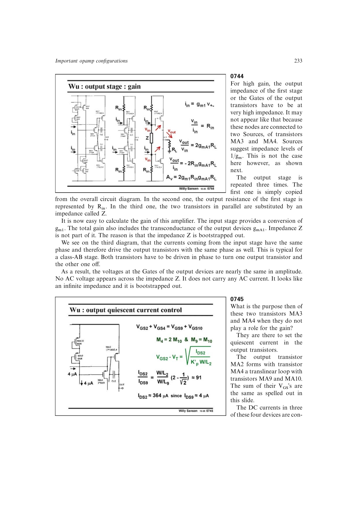

# Class-AB 栅极自举

Class-AB 输出管两栅极近似同相同幅运动，因此跨接在两栅之间的偏置阻抗几乎没有交流电压，也不承载交流电流。它在小信号增益路径中等效为很大的阻抗，被自举“移除”。

所以连接到两栅的源极跟随偏置管不会把前级输出阻抗简单拉到 (1/g_m)；前级仍可保持高增益。

第 12 章的跨线性输出级再次说明这种 DC/AC 分工：偏置管承载设定静态电流所需的 DC，却因输出管两栅同相运动而几乎不承载 AC。它们因此不进入主要电压增益或 GBW 表达式，宽带电平移位器也可按同一原则处理。

来源：第 7 章 p. 233，0744；第 12 章 pp. 347-350，1221-1226。

## 原书图示

