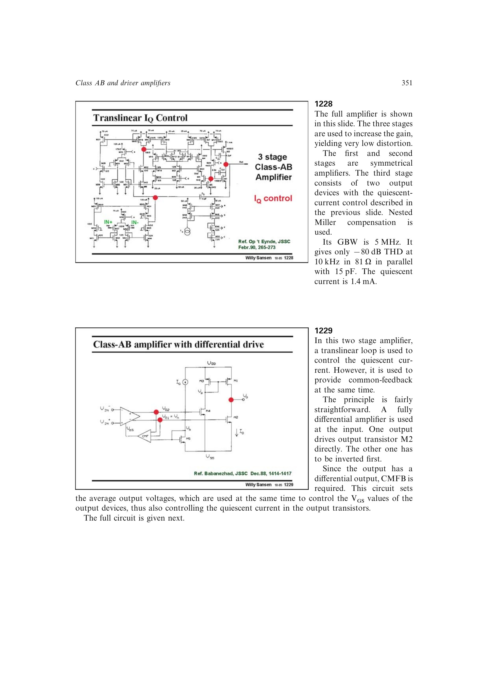

# CMFB 静态电流协同控制

全差分前级必须用 CMFB 设定两个输出的平均电压。若这些输出同时直接驱动 Class-AB 功率管栅极，其平均值也决定上下输出管的 `VGS` 和静态电流。

可让同一组共模感知器件同时属于跨线性偏置环：CMFB 调整前级平均输出时，输出级 `IQ` 也随之收敛。这样复用传感与控制节点，但共模稳定性和静态电流精度成为耦合问题。

来源：第 12 章 pp. 351-352，1229-1230。

## 原书图示

