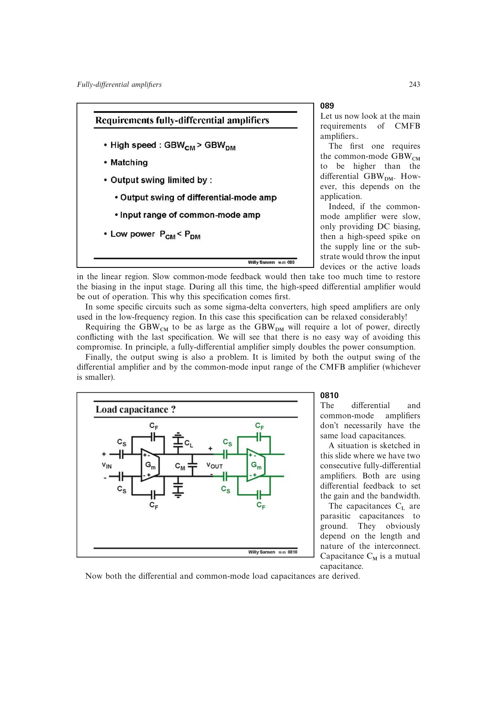

# CMFB 速度-功耗折衷

一般应使 (GBW_{CM}>GBW_{DM})，否则快速共模扰动可能把输入管或有源负载推入线性区，并让差分通道在漫长恢复期间失效。低速应用可放宽该要求。

CMFB 又常驱动更大负载并工作于单位增益；高速度因此显著增加电流。输出摆幅还受差分放大器本身和 CMFB 输入范围中的较小者限制。

来源：第 8 章 pp. 243-245，089-0813。

## 原书图示

