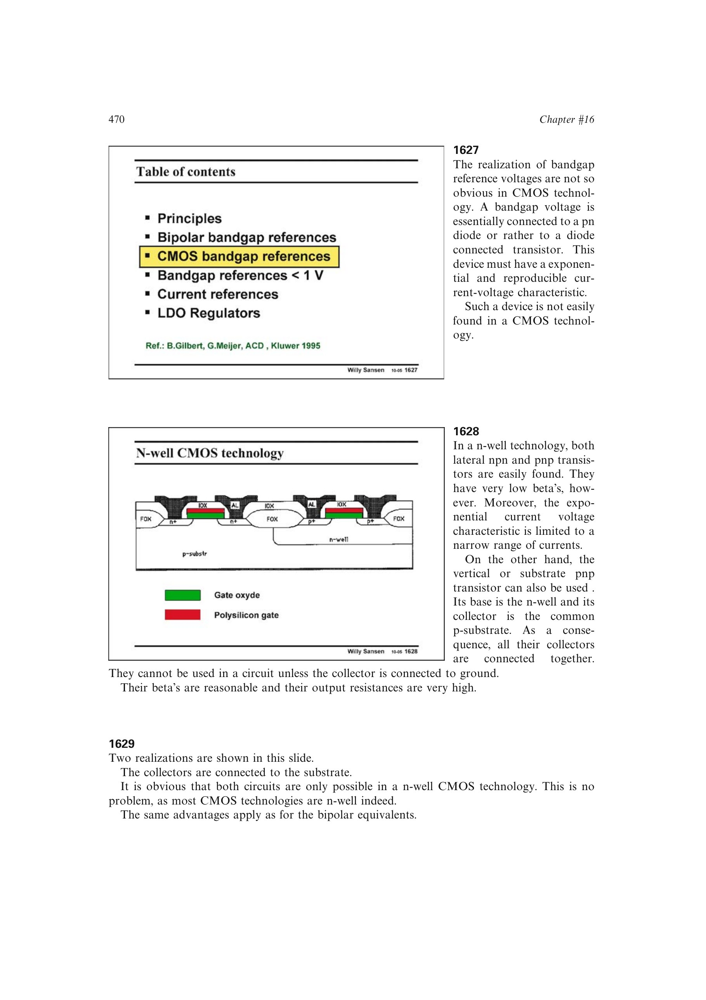

# CMOS 带隙基准失调敏感性

CMOS 运放的输入失调通常显著大于双极型运放。带隙闭环把这项失调叠加到面积比双极管的 `Delta VBE` 上，破坏两支路电流相等，进而以 PTAT 增益放大到输出。

大尺寸弱反型输入管可降低随机失调和 1/f 噪声，但启动极性、功耗和补偿也随之受限。高精度实现还可能使用斩波、采样同一器件或输出修调。

来源：第 16 章 pp. 470-472、467，1629-1630、1622。

## 原书图示

