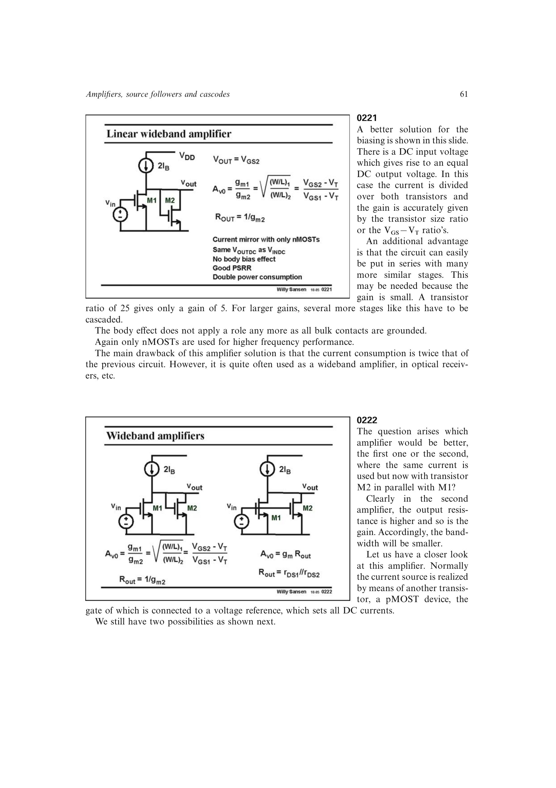

# CMOS 反相器模拟放大级

数字 CMOS 反相器偏置在传输曲线中点时可作为模拟 class-AB 放大器。若 nMOST 与 pMOST 的偏置电流和跨导匹配，小信号总跨导为 `gmn+gmp`，输出电阻为两管 `rDS` 的并联。

两管在小信号下共同驱动输出，形成电流复用，GBW 约为单管同负载情形的两倍。静态点通常取输入/输出约为 `VDD/2`，尺寸比需补偿 n/p 工艺参数差异。其大信号电流随输入变化，且对电源电压敏感。

第 12 章把它作为最简单的 Class-AB 扩张型电流级：负载电流是上下管电流之差，可远大于静态电流。但两只 `VGS` 直接跨在电源之间，静态电流随电源变化，电源尖峰也直接进入信号通道，PSRR 约为 0 dB。

来源：第 2 章 pp. 61-68，0222-0234；第 12 章 pp. 340-341，127-128。

## 原书图示

