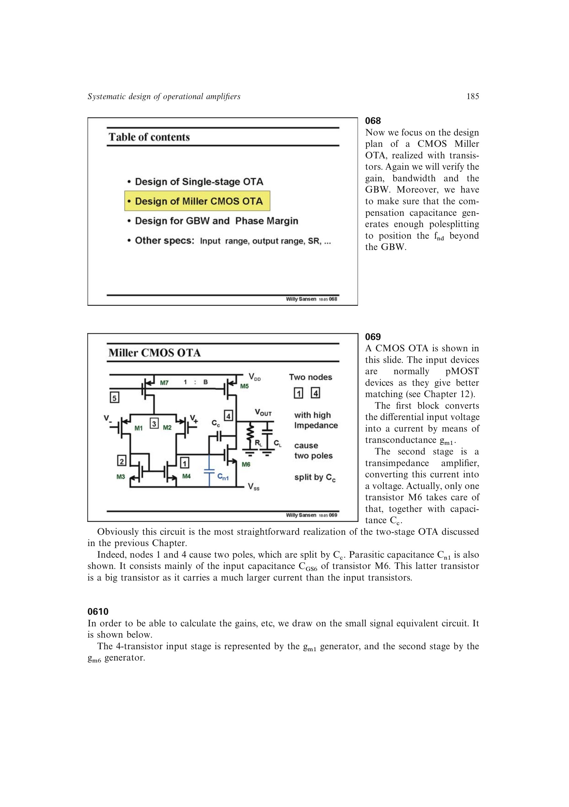

# CMOS Miller OTA

书中的基准两级 CMOS Miller OTA 以 pMOST 差分对和电流镜构成输入跨导级，以单管 `M6` 构成第二级，并在两个高阻节点之间跨接 `C_c`。内部节点电容 `C_n1` 主要由大尺寸输出管 `M6` 的 `C_GS6` 构成。

小信号模型归结为两个跨导、两个节点电阻、两个对地电容和一只跨级补偿电容，可直接套用两级 Miller 稳定性公式。

来源：第 6 章 pp. 185-187，068-0612。

## 原书图示

