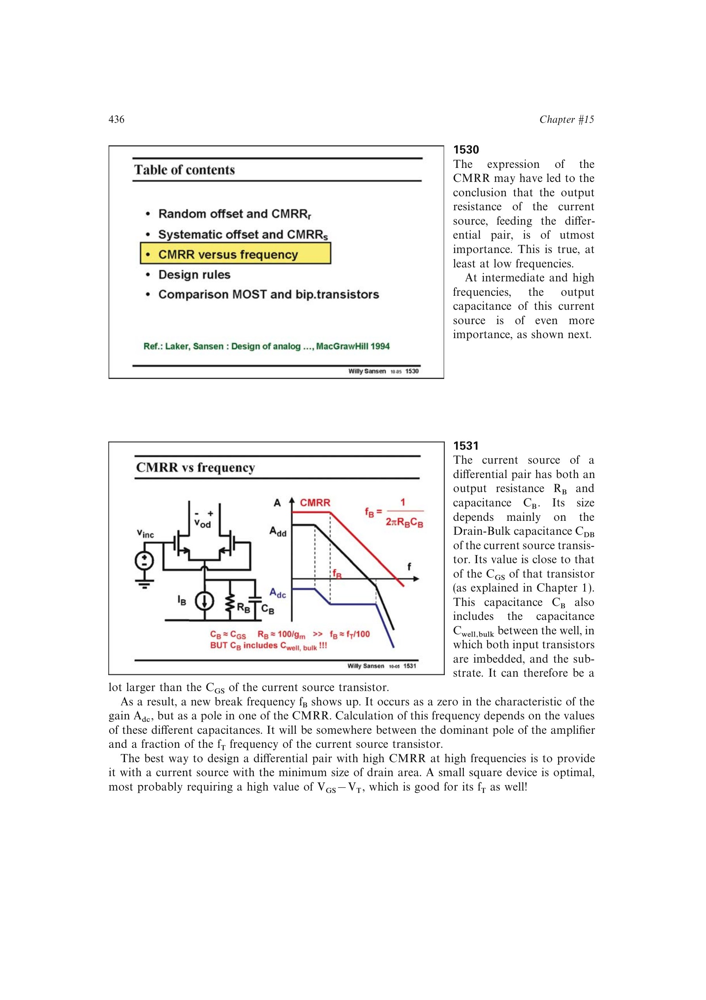

# CMRR 高频滚降

尾电流源节点不仅有输出电阻 `RB`，还含漏体结电容及输入对共阱到衬底的电容 `CB`。它们引入

`fB = 1/(2*pi*RB*CB)`，

使 `Adc` 出现零点、CMRR 出现极点。高频 CMRR 因而更受尾节点电容而非 DC 输出电阻控制。减小尾管漏区面积、采用较小近方形器件可降低 `CB`，较大过驱动也有利于尾管 `fT`。

来源：第 15 章 pp. 436-437，1530-1531。

## 原书图示

