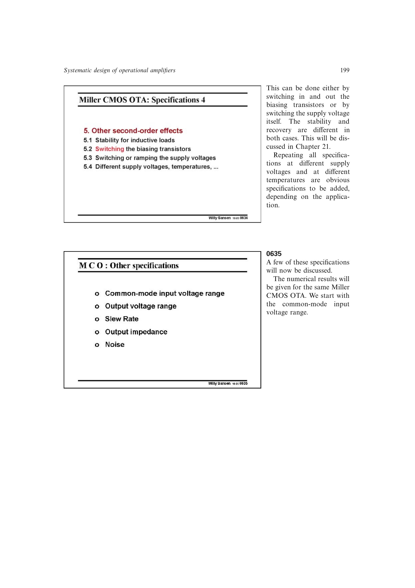

# Miller OTA 共模输入范围

基准 pMOST 输入 Miller OTA 的最高共模输入约由 `V_DD-V_GS1-V_DS7` 限制，最低端则由输入对、镜像负载和尾电流源的电压叠加限制。范围强烈依赖各管过驱动和饱和裕量。

因此该拓扑不能天然实现轨到轨输入；降低电源时必须在尺寸设计前检查所有串叠器件仍满足工作区条件。

来源：第 6 章 pp. 199-201，0635-0637。

## 原书图示

