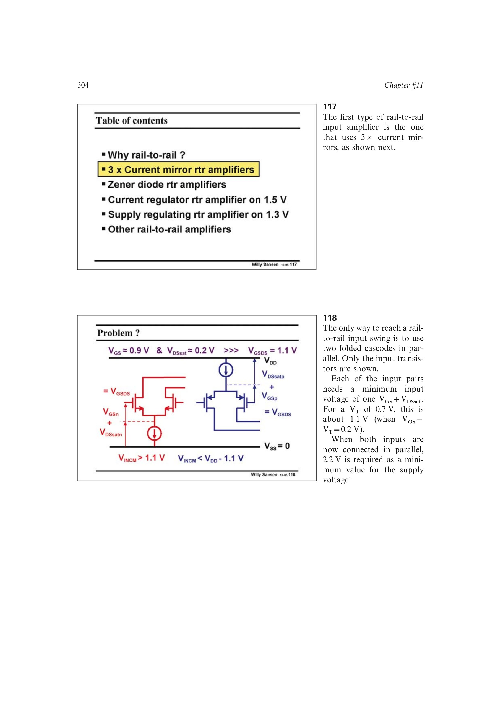

# 互补输入级电源下限

并联 nMOST、pMOST 折叠输入对时，每套输入支路至少需要约 `VGS+VDSsat`。若要求两套在共模中点同时导通，电源下限约为

`VDD,min=2(VGS+VDSsat)`。

书中 `VT=0.7 V`、`VOV=0.2 V` 的例子约需 2.2 V，实际采用约 2.5 V；即使 `VT=0.3 V`，重叠导通仍约需 1.4 V。

来源：第 11 章 pp. 304-305，117-119。

## 原书图示

