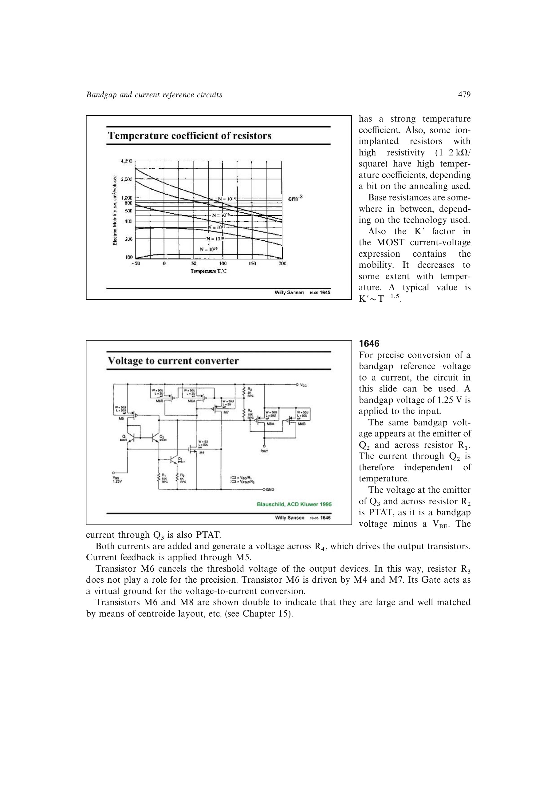

# 复合温度电流基准

高精度电流基准可同时生成温度近似不变的 `VBG/R1` 支路和 PTAT 的 `(VBG-VBE)/R2` 支路，再按比例相加驱动输出。反馈使阈值电压和中间电阻不进入一阶转换精度。

两类温度系数给出额外自由度，可补偿输出器件和电阻温漂。关键镜像器件需大面积、共质心和相同工作电压，以免失配重新成为主导。

来源：第 16 章 pp. 479-480，1646。

## 原书图示

