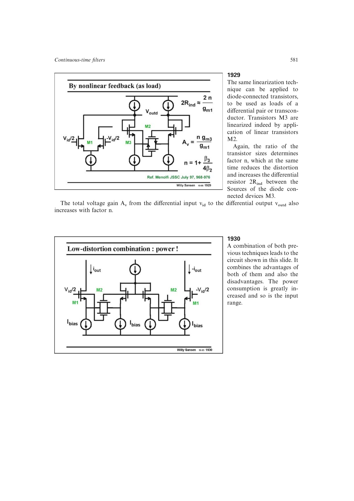

# 复合跨导线性化

复合跨导线性化在同一信号通路叠加源退化、主动反馈和交叉耦合抵消。反馈先展宽低幅输入范围，交叉耦合在更大摆幅附近抵消三阶曲率，因此可获得比任一单独手段更宽的低失真区。

代价是跨导下降、功耗和节点数增加，寄生极点降低最高频率，抵消点还依赖器件与偏置匹配。源书实例在约 `2.4 Vptp` 输入下达到约 0.1% `HD3`。

来源：第 19 章 pp. 581-584，图 19.30-19.34。

## 原书图示

