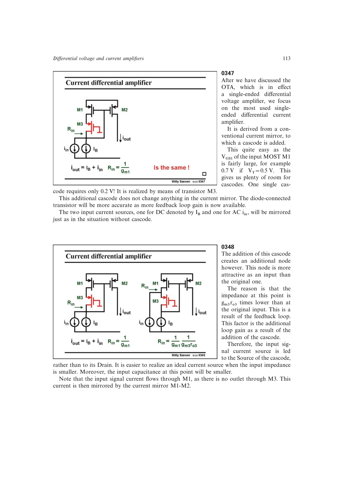

# 差分电流放大器

在电流镜输入和输出支路加入 cascode，可从两个低阻节点注入电流并在高阻输出节点形成差值。输入 1 的阻抗被 cascode 环路降低约 `gm*ro` 倍；另一输入在小负载时约为 `1/gm`。

输出电流是在 DC 偏置上叠加的差分信号，常用于把运放内部差分电流转换成单端电流。除输出外的节点都在 `1/gm` 或更低阻抗，因而适合宽带和低电源电压。

第 12 章把其低压余量用于 Class-AB 驱动：按 `VT=0.7 V`、`VOV=VDSsat=0.15 V` 可在约 1 V 工作；若 `VT=0.3 V`，最低电源约 0.6 V。额外电流输入还可形成不受固定尾电流限制的扩张型电流路径。

来源：第 3 章 pp. 113-115，0347-0351；第 12 章 pp. 354-360，1235-1245。

## 原书图示

