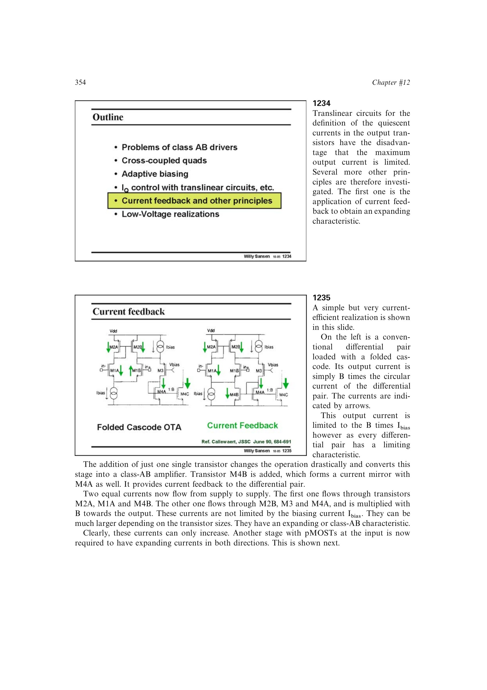

# 电流反馈 Class-AB 级

电流反馈 Class-AB 级在普通差分对的折叠电流输出处只增加一只镜像管，把输出支路电流反馈到输入支路。两条从电源到电源的环流不再受固定尾电流限制，可随输入持续增加。

单极性实现只能在一个方向产生扩张电流；并联互补 nMOST、pMOST 版本后可获得双向 Class-AB 传输。它器件少、效率高，但反馈镜像的极性和工作区必须正确。

来源：第 12 章 pp. 354-355，1234-1236。

## 原书图示

