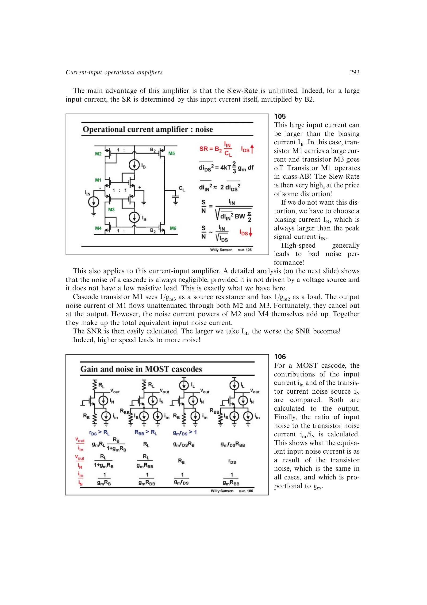

# 电流输入运放噪声速度折衷

基本 CMOS 电流输入前端的两只主要镜像器件贡献等效输入电流噪声，噪声功率相加，量级随 `g_m` 和偏置电流增大。书中近似给出 `di_in^2≈2di_DS^2`，积分后 SNR 随偏置电流增大而下降。

提高 `I_B` 可扩大无失真输入电流和高速工作范围，却提高输入电流噪声；允许 Class-AB 过驱又会引入失真。因此速度、噪声和线性范围必须共同定偏置。

来源：第 10 章 p. 293，105。

## 原书图示

