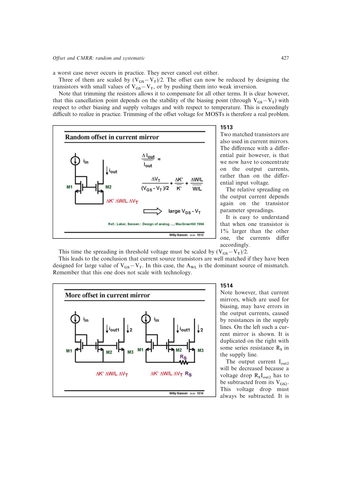

# 电流镜随机电流误差

MOST 电流镜的随机相对输出误差近似为

`Delta Iout/Iout = Delta VT/(VOV/2) + Delta K'/K' + Delta(W/L)/(W/L)`。

这与差分对失调的尺度选择相反：增大 `VOV` 会压低阈值失配对电流比的影响，使几何项更可能主导。因此低失调输入对倾向小 `VOV`，精密电流源则倾向较大 `VOV`。

来源：第 15 章 p. 427，1513。

## 原书图示

