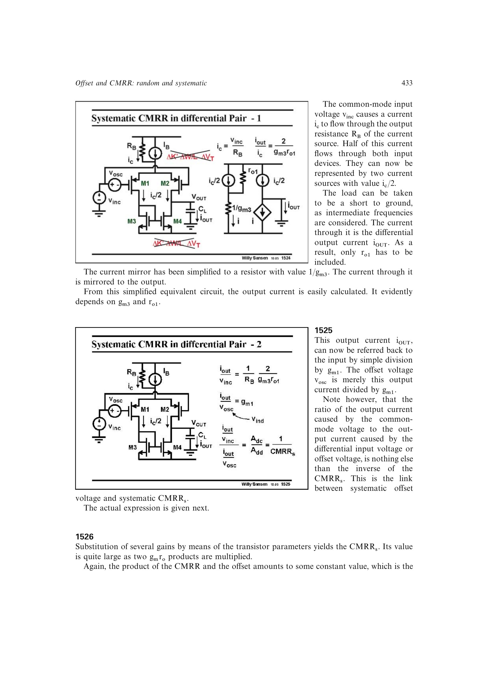

# 差分对系统性 CMRR

对有源负载 MOST 差分对，源书的小信号模型给出

`CMRRs = (1/2)*gm1*RB*gm3*ro1`，且 `CMRRs*vosc = vinc`。

第一个 `gm*RB` 抑制尾源共模电流，第二个 `gm*ro` 描述镜像负载把该电流转换成差模误差的尺度。两个本征增益相乘可给出很高的系统性 CMRR，但只有在系统性失调也足够小时才能兑现。

来源：第 15 章 pp. 433-434，1524-1526。

## 原书图示

