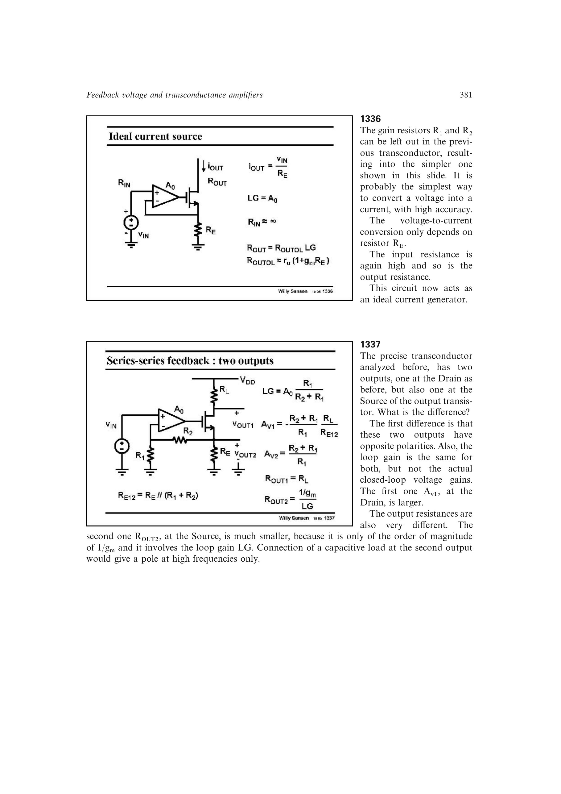

# 局部反馈双输出级

同一反馈输出管可在漏极或集电极取得反相高增益、高阻输出，也可在源极或射极取得同相近单位增益、低阻输出。两端共享环路增益，但闭环电压增益、极性和输出阻抗不同。

源端输出阻抗约为 `(1/gm)/(1+T)`；局部单管版本的跟随器输出约为 `1/gm`，因此容性负载极点比高阻输出端高得多。

来源：第 13 章 pp. 381-383、386，1337-1340、1347。

## 原书图示

