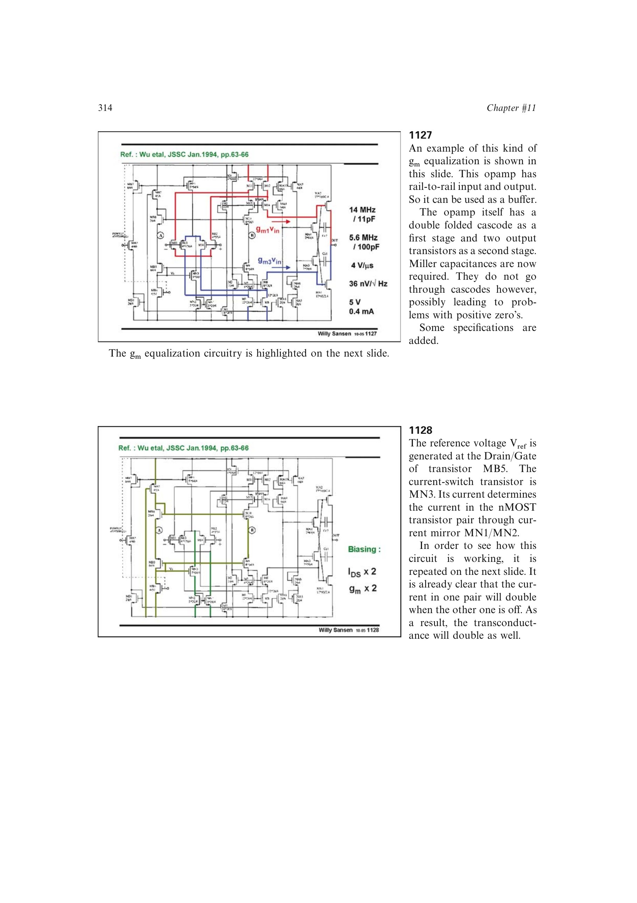

# 双路径 Miller 补偿

互补折叠输入级在某一共模极端可能只有一条折叠级联路径仍工作。若第二级只通过单一路径接入 Miller 电容，另一输入对接管时就会失去有效补偿。

因此每个输出需要从第二级输出分别跨接到两条一级输出路径，形成两只 Miller 电容；全差分实现共需四只。电容若不穿过级联管，还要检查前馈形成的右半平面零点。

来源：第 11 章 pp. 314，318-319，1127、1135-1136。

## 原书图示

