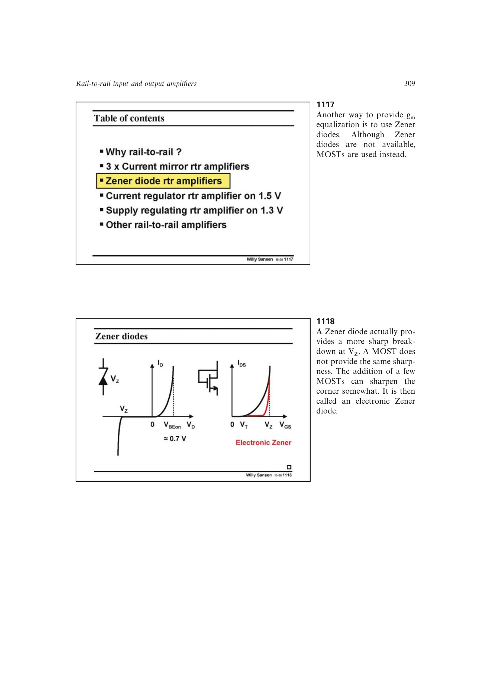

# 电子齐纳跨导均衡

电子齐纳均衡器以二极管连接 MOST 的串联压降检测共模转换。中点时大尺寸二极管支路吸收大部分尾电流；一套输入对关闭后，该支路也截止，全部电流转给仍导通的输入对，使每管电流由 `I_B` 增到 `4I_B`。

普通 MOST 的转折较软，跨导误差可约 25%；并联辅助放大器和源跟随器锐化电子齐纳转折后，误差可降至约 6%，且边缘大电流提高压摆率。

来源：第 11 章 pp. 309-312，1117-1122。

## 原书图示

