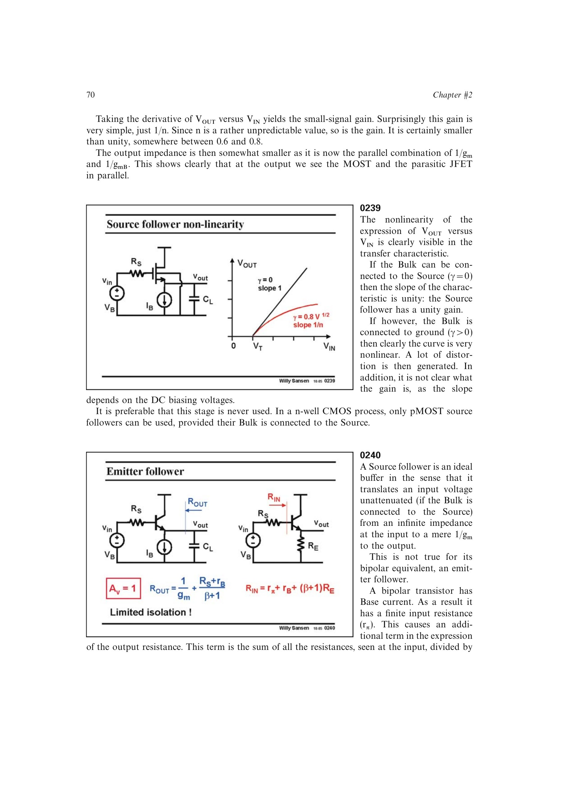

# 射极跟随器有限隔离

双极型射极跟随器的基极电流使输入阻抗有限。输出端看到的源电阻附加项约为输入侧总电阻除以 `beta+1`；反过来，发射极负载映射到输入端时约乘 `beta`。

所以射极跟随器只能提供约 `beta` 的阻抗隔离，而理想 MOST 源跟随器因栅电流近零可提供更强隔离。极高源阻抗前端有时需要串联多个射极跟随器。

来源：第 2 章 pp. 70-71，0240。

## 原书图示

