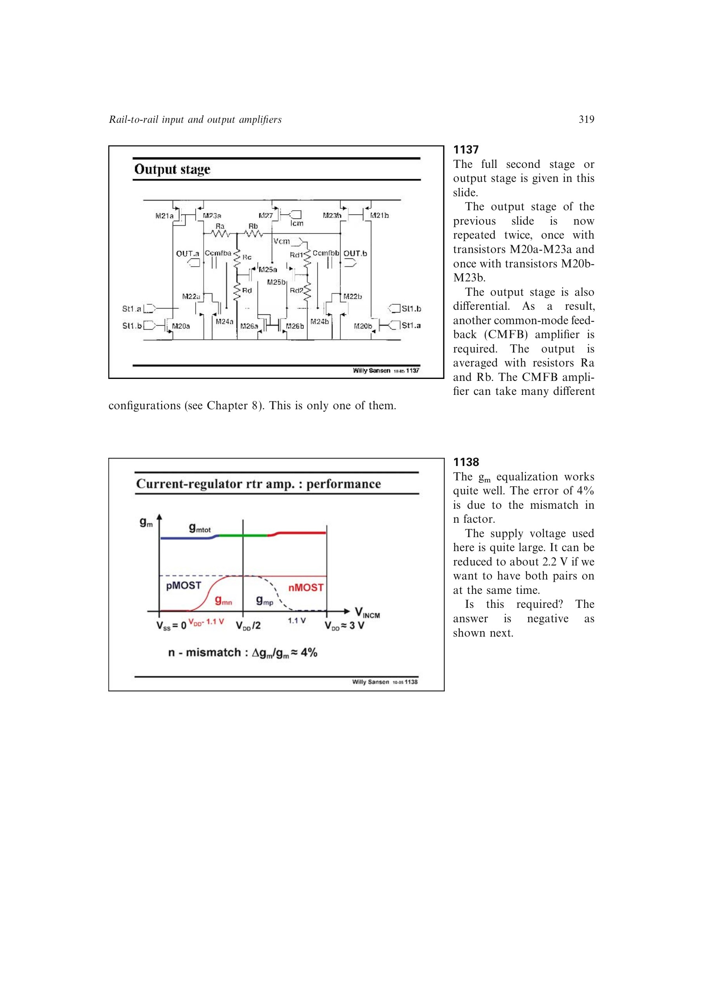

# 精确交越电源缩放

互补输入对不必存在两对都完全导通的宽重叠区。可降低电源，使 pMOST 对恰在 nMOST 对接管时关闭；在共模中点两对跨导各降到边缘单对跨导的一半，总跨导仍连续。

书中弱反型实例在约 1.5 V 达到该交越；低阈值器件可低于 1 V。限制是交越电压依赖绝对 `V_T`，不能仅靠名义值预设，必须留工艺容差或用反馈自动跟踪。

来源：第 11 章 pp. 319-321，1138-1140。

## 原书图示

