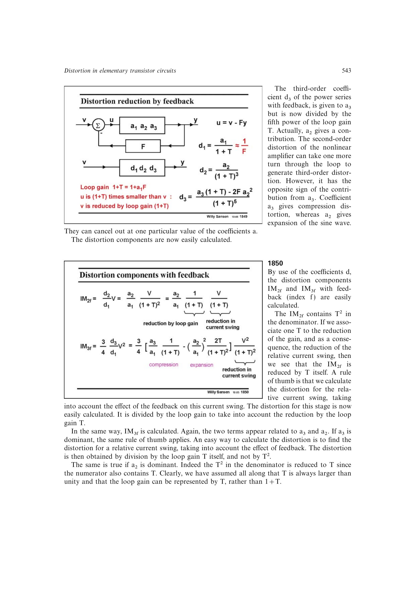

# 反馈诱生三阶失真

理想平方律 MOST 开环只有二阶项，但其二阶失真经反馈环路再次作用于同一非线性，会形成三阶项。因此对单管平方律放大器加反馈后，即使开环 `a3=0`，闭环 `IM3` 也不为零。

这个结果说明反馈会降低总失真，却可能改变各阶失真的来源和极性；闭环三阶预算必须保留 `a2` 的再循环贡献。

来源：第 18 章 pp. 543-544，图 18.49-18.51。

## 原书图示

