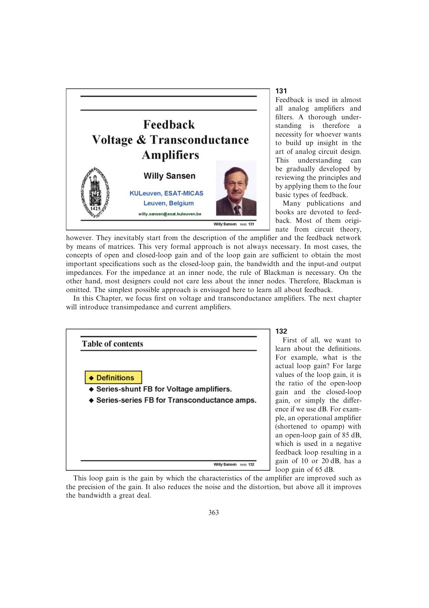

# 反馈端口拓扑

反馈在输入端可串联混合或并联混合，在输出端可并联取样或串联取样，因此形成串并、并并、并串、串串四种基本拓扑。输入连接决定信号以电压还是电流进入，输出连接决定反馈网络取样电压还是电流。

拓扑名称按“输入连接-输出连接”排列。它不是器件类别：同一拓扑可由运放、MOS、BJT 或混合器件实现。

来源：第 13 章 pp. 363-371，131-1315。

## 原书图示

