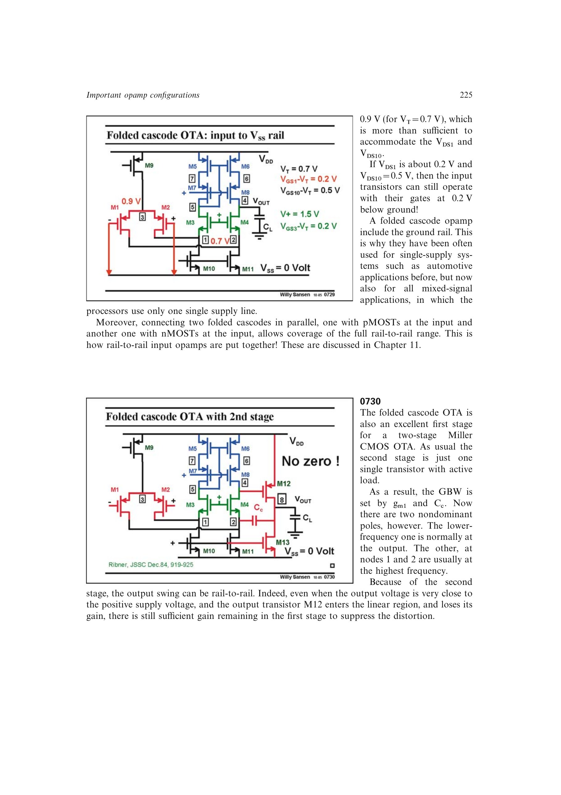

# 折叠级联 Miller OTA

折叠级联 OTA 可作为两级 Miller 运放的高增益第一级，第二级仍是带有有源负载的单管共源级。GBW 由输入跨导和补偿电容决定。

该结构有两个主要非主极点：较低者通常在输出端，节点 1、2 的内部极点更高。第二级提供额外增益，使输出管接近线性区时仍能靠前级环路增益压低失真，输出摆幅可接近电源轨。

来源：第 7 章 p. 225，0730。

## 原书图示

