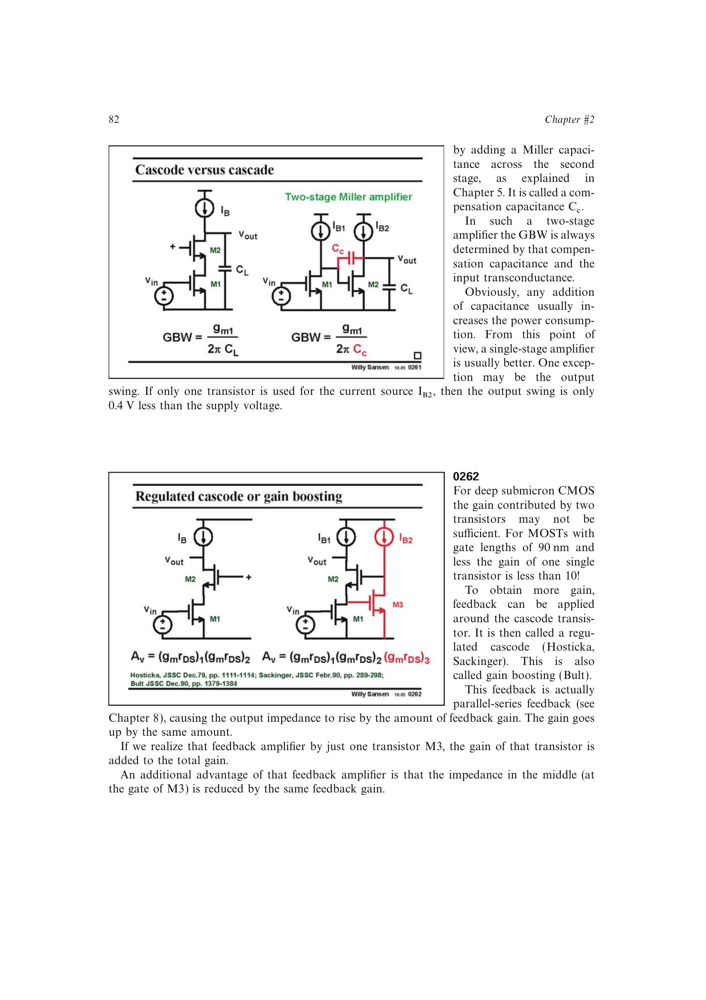

# 级联管增益提升

增益提升（regulated cascode）用局部放大器监测并稳定级联管源端电压。反馈使输出电阻和低频增益再乘以局部环路增益，同时降低中间节点阻抗。

它仍是低频增益增强，不改变由输入 `gm` 与负载 `CL` 决定的 GBW。深亚微米高速器件本征增益低时，它可兼顾高 GBW 与高 DC 增益；局部放大器自身的增益和带宽必须与主 cascode 动态匹配。

来源：第 2 章 pp. 82-84，0262-0264。

## 原书图示

