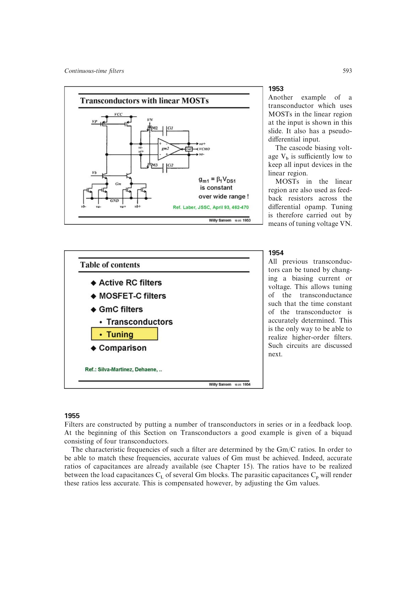

# Gm-C 频率调谐

Gm-C 频率调谐用匹配的复制跨导块生成公共控制量，把主滤波的 `gm/C` 锁到外部参考。参考可由绝对电阻、开关电容时钟或充电平衡比例提供；三种方法分别在绝对精度、参考纹波和时钟隔离之间取舍。

调谐修正共同工艺与温度漂移，但不能消除主滤波各跨导块之间的随机失配、寄生电容差异或有限环路带宽。

来源：第 19 章 pp. 593-598，图 19.54-19.62。

## 原书图示

