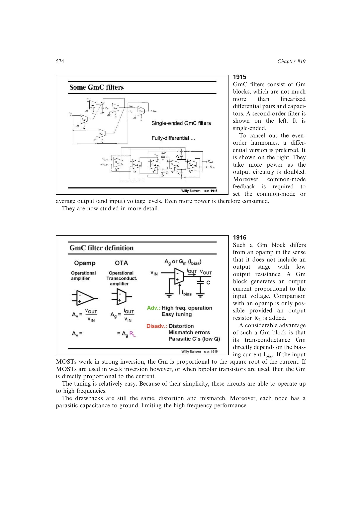

# Gm-C 寄生电容上限

Gm-C 极点依赖设计负载电容 `CL`，而跨导块输入、输出寄生都会并入该状态节点。要让极点频率由可控元件决定，必须满足 `Cp << CL`。

减小 `CL` 虽能提高 `Gm/CL` 频率，却会放大寄生占比与工艺误差；这给 Gm-C 最高准确工作频率设下直接上限。

来源：第 19 章 pp. 574-576、593-594，图 19.16、19.19、19.55。

## 原书图示

