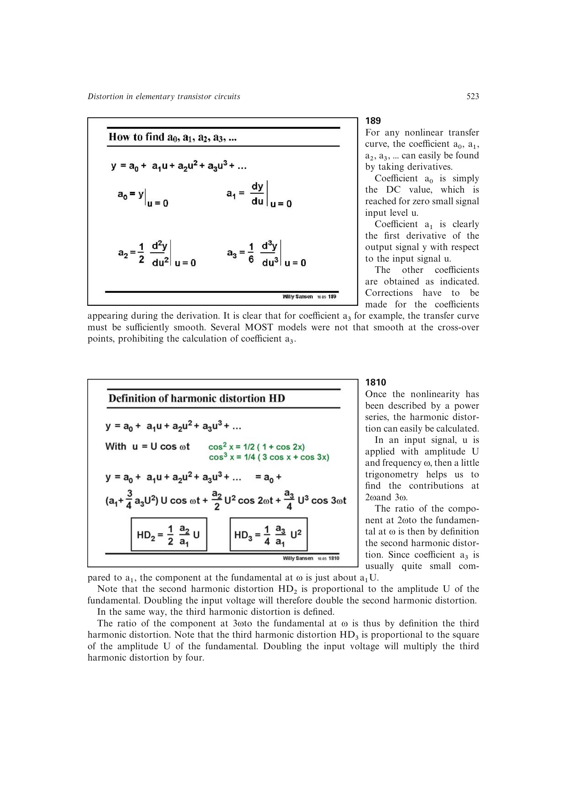

# 谐波失真

对单音输入 `u=U*cos(omega*t)`，幂级数的平方项和立方项分别在 `2*omega`、`3*omega` 产生新谱线。相对于基波幅度，低失真近似为

`HD2 = (1/2)*(a2/a1)*U`，

`HD3 = (1/4)*(a3/a1)*U^2`。

这里忽略高阶项对基波的微小修正，因此只适用于弱失真区。

来源：第 18 章 pp. 523-524，图 18.10-18.11。

## 原书图示

