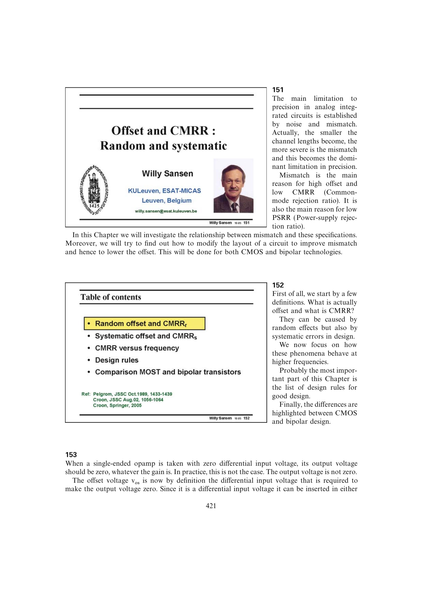

# 输入失调电压

输入失调电压 `vos` 定义为：使放大器输出回到零所需施加的差分输入电压。把它移到另一输入端时，幅值不变而符号反转。

失调是输入等效量，不等同于零输入时直接测得的输出误差。高闭环增益会把很小的 `vos` 放大成显著输出偏差；源书示例中 4 mV 失调使原本 1000 倍的热电偶放大器产生很大的增益误差。

来源：第 15 章 pp. 421-422，153-154。

## 原书图示

