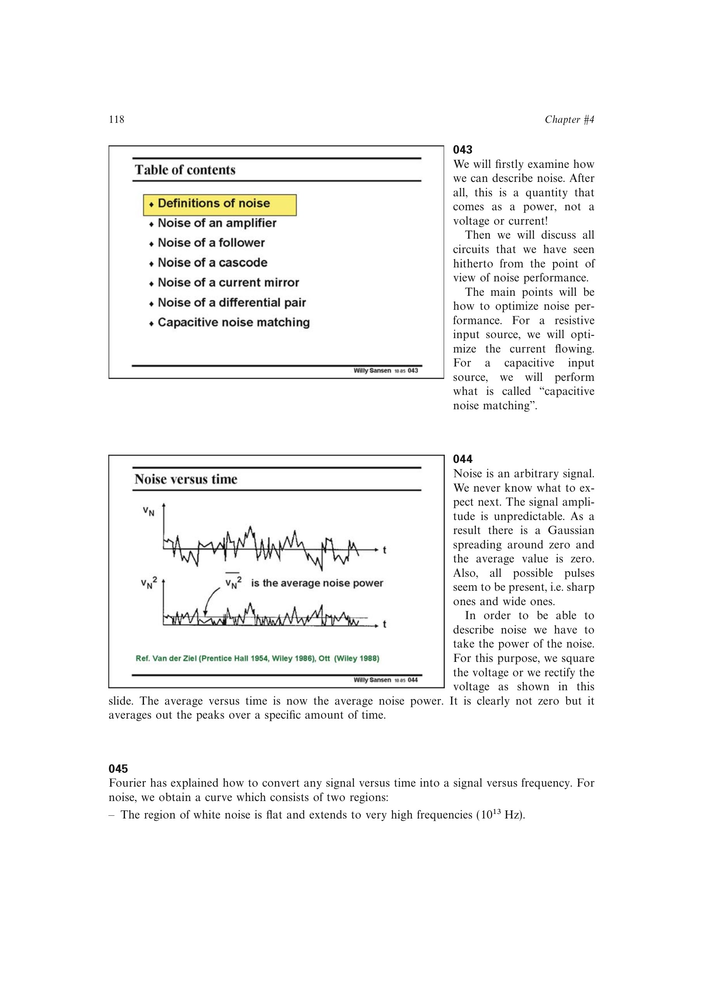

# 积分噪声

频带 `[f_L,f_H]` 内的总均方噪声为 `v_n,rms^2 = integral(S_v(f) df)`。对白噪声，它等于平坦谱密度乘以带宽；对 `1/f` 噪声，积分含 `ln(f_H/f_L)`，因此下限频率不能省略。

积分噪声直接决定可达到的信噪比。它的单位是 `V^2`，开平方后是 `V_RMS`。

来源：第 4 章 pp. 118-121，043-048。

## 原书图示

