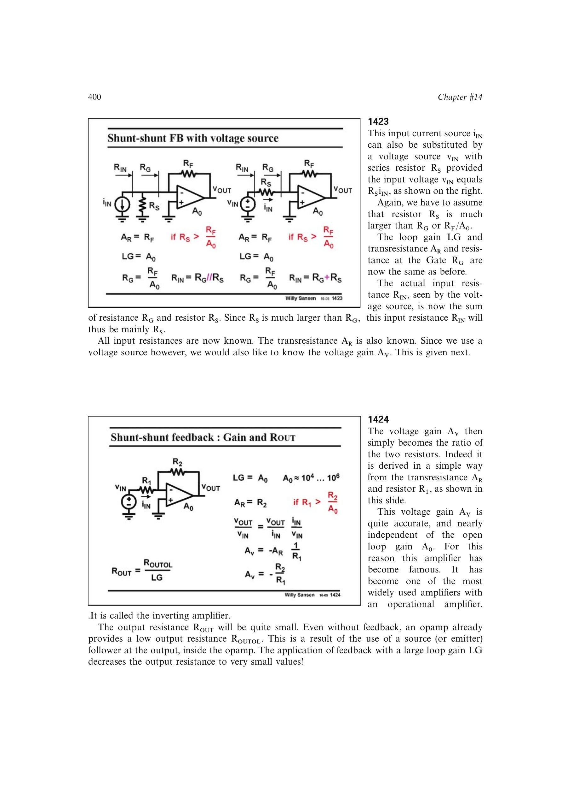

# 反相反馈电压放大器

把 Norton 输入源变换为 `vin=RS*iin` 的 Thevenin 电压源后，并并联跨阻电路成为经典反相放大器。若 `RS>>RG`，电压增益 `Av=vout/vin=-RF/RS`，输入电阻约为 `RS+RG~=RS`。

闭环比例由两个电阻决定，输出阻抗再由大环路增益压低；有限放大器输入阻抗或晶体管基极电流会破坏这一理想比例。

来源：第 14 章 pp. 400-402，1423-1427。

## 原书图示

