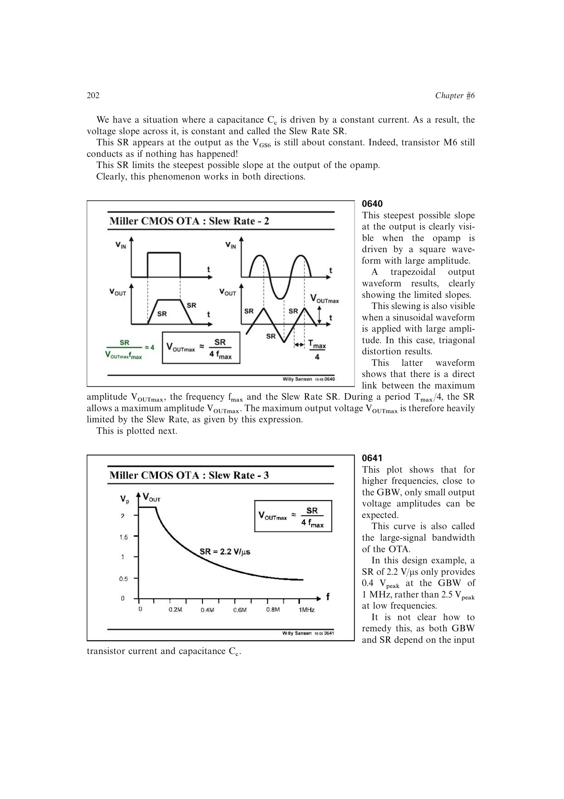

# 大信号带宽

正弦输出 `v=V_pk sin(2pi f t)` 的最大斜率为 `2pi f V_pk`。受压摆率限制时，最大无压摆幅度为 `V_pk,max=SR/(2pi f)`，随频率反比下降。

这条幅度-频率边界称为大信号带宽；书中 1 MHz OTA 在 GBW 附近只能输出远小于低频摆幅的正弦信号。

来源：第 6 章 pp. 202-203，0640-0642。

## 原书图示

