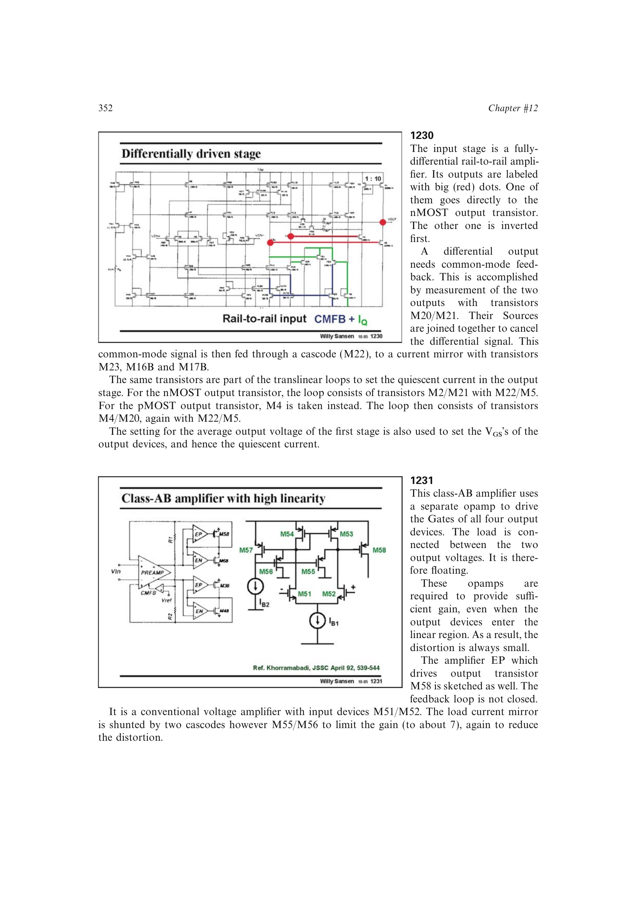

# 输出管局部误差放大

输出管局部误差放大为每只功率器件配置小型电压放大器，用局部反馈强制栅极获得所需驱动。即使功率管进入线性区、开环跨导和输出电阻下降，误差放大器仍可维持环路增益。

书中浮置负载实例用四个局部放大器驱动四只输出管，并用跨线性环设置静态电流。该结构能降低大摆幅失真，但增加环路数量、补偿难度和面积。

来源：第 12 章 pp. 352-353，1231-1232。

## 原书图示

